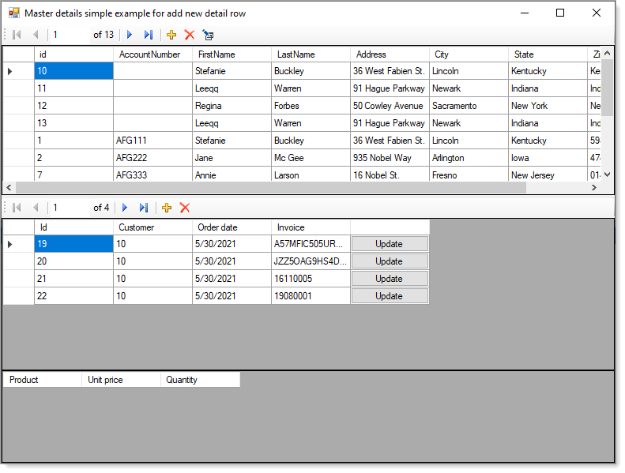

### Windows forms Master-detail view with add/edit/delete on SQL-Server

A business application can be created to interact with one database table that is fairly simple to write yet the majority of business applications are written on top of a relational database e.g. a table for customers, a related table for addresses another table for phone numbers, a table for products, orders and order details, vendors to purchase from and shippers to ship orders. 

Attempting to write an order based application with less tables is possible yet down the road will eventually develop issues and time to fix issues that could be avoided with a good database design. 

## Objective
Show how to setup relationships between related table for SQL-Server database with basics for adding, updating, deleting records in a Windows form solution using SqlClient data provider.

> The next step is to move to Entity Framework 6 ORM. With Entity Framework 6 relationships are setup when scafolding to normalized database. To get an idea see [the following repository](https://github.com/karenpayneoregon/EntityFrameworkSolutionStructureWindowsForms_VisualBasic).

## Source code  
Both VB.NET and C# base projects are presented using class projects for data operations interacting with Windows Form projects.

For details see [the following TechNet article](https://social.technet.microsoft.com/wiki/contents/articles/53240.windows-forms-master-detail-view-with-addeditdelete-on-sql-server-with-vb-netc.aspx).

